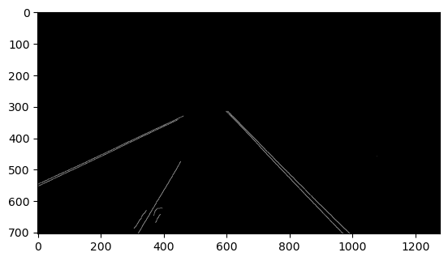

# Road Lane Detection

A manual implementation of the Hough transform to aid in the task of road lane detection.


This project was developed as part of the course Computer Vision in the Fall 2022 semester at the Faculty of Engineering, Alexandria University, under the Computer and Communications Engineering department, supervised by Dr. Marwan Torki.

## Steps

1- Smoothing the image using a 2-dimensional median smoothing filter.


2- Edge Detection using Canny’s algorithm.


3- Region Of Interest selection.



4- Accumulation into (ρ, θ)-space using Hough transform.


## Prerequisites

This project was developed in the following environment:

- Jupyter Notebook
- Miniconda
- Python 3.11.5

## Installing

1- Clone the repository to your local machine:

```bash
git clone https://github.com/MohEsmail143/road-lane-detection.git
```

2- Open Jupyter notebook.

3- Check out the the Jupyter notebook `road_lane_detection.ipynb`.

## License

This project is licensed under the MIT License - see the [LICENSE.md](LICENSE) file for details.
